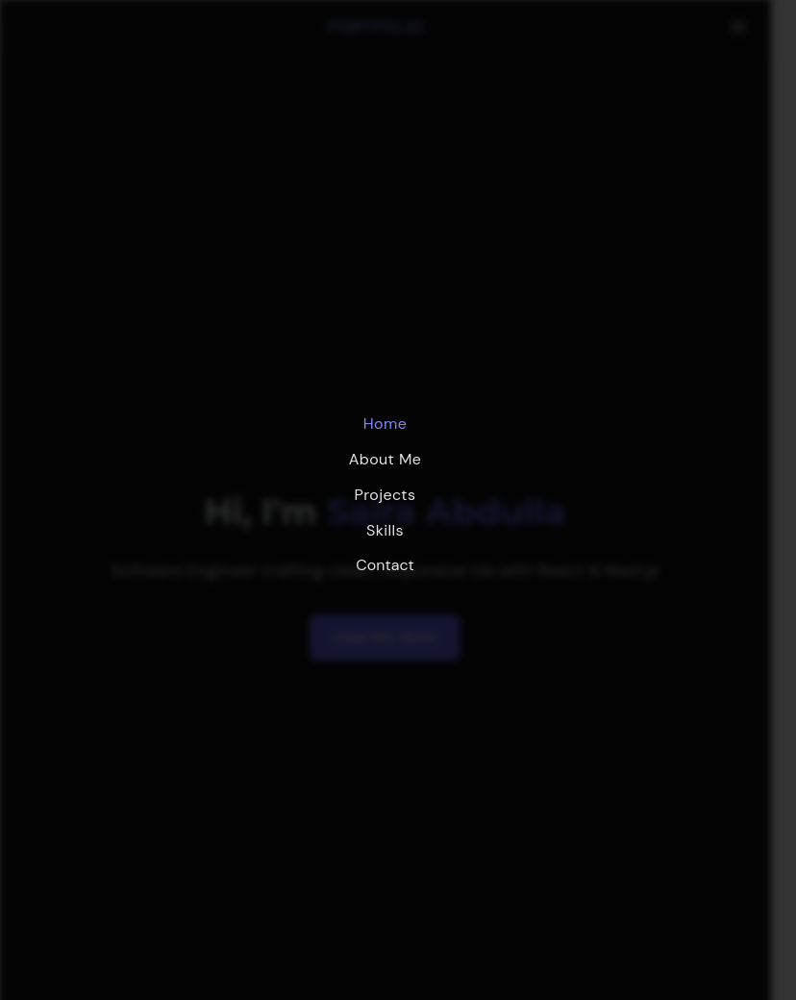

# 💼 Saira's Developer Portfolio

A responsive and accessible developer portfolio built with **React**, **TypeScript**, **Tailwind CSS**, and **Framer Motion**. Designed and developed from scratch to showcase projects, skills, and a bit about me — no templates used.

## 🚀 Features

- 🌗 Light/Dark theme toggle
- 📱 Fully responsive design
- 💻 Built with React + TypeScript
- 🎨 Styled using Tailwind CSS
- 🎞️ Smooth animations with Framer Motion
- 📌 Smooth Navigation with active page highlighting
- 📜 Accessible, semantic markup
- 🧩 Modular and clean component structure

## 📸 Screenshots




## 🛠️ Tech Stack

- **Frontend:** React, TypeScript, Tailwind CSS
- **Animations:** Framer Motion
- **Icons:** Lucide React
- **Font:** Montserrat & DM Sans via Google Fonts

## 📂 Project Structure

```bash
src/
├── components/       # Reusable components
├── sections/         # Home, About, Projects, Contact, etc.
├── shared/           # Types and constants
├── assets/           # Static images/icons
└── App.tsx           # Main app
```

## 🔧 Getting Started

1. **Clone the repo**

```bash
git clone https://github.com/saira512dev/ReactPortfolio.git
cd ReactPortfolio
```

2. **Install dependencies**

```bash
npm install
```

3. **Run the app**

```bash
npm run dev
```

4. **Build for production**

```bash
npm run build
```

## 📫 Contact

If you'd like to collaborate, hire, or just say hi:

- **Email:** sairaabdullapa@gmail.com
- **LinkedIn:** [linkedin.com/in/yourprofile](https://www.linkedin.com/in/saira-abdulla/)

## 📄 License

This portfolio was designed and developed from scratch by me to reflect my personal and professional growth.

You're welcome to explore the code and learn from it. If you are using it, I would aprreciate a shoutout or a star on my repo.

---
